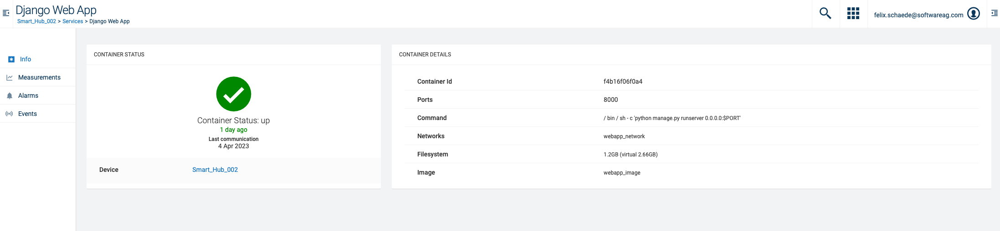
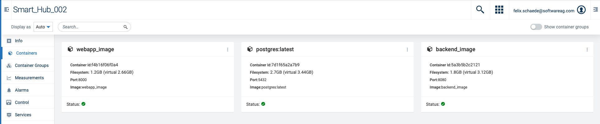
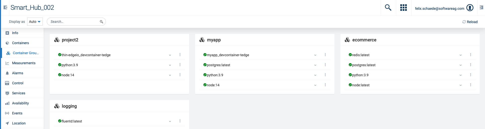

# tedge-container-plugin

thin-edge.io container plugin to install, start, stop and monitor containers on a device.
Cumulocity UI Plugin to monitor running containers in the UI.

## Plugin summary

The following thin-edge.io customization is included in the plugin.

The instructions assume that you are using thin-edge.io &gt;= 1.0.0

### What will be deployed to the device?

* A service called `tedge-container-monitor`. This provides the monitoring of the containers
* The following software management plugins which is called when installing and removing containers/container groups via Cumulocity IoT
    * `container` - Deploy a single container (`docker run xxx` equivalent)
    * `container-group` - Deploy one or more container as defined by a `docker-compose.yaml` file (`docker compose up` equivalent)

**Note**

Child device support does not make any sense with this plugin as it needs to install/remove/monitor containers running on the current device (where the container engine is running). Though I guess you could try modifying the `DOCKER_HOST` environment variable etc. Though PRs are welcome to extend/edit any of the features ;)

**Technical summary**

The following details the technical aspects of the plugin to get an idea what systems it supports.

|||
|--|--|
|**Languages**|`shell` (posix compatible)|
|**CPU Architectures**|`all/noarch`|
|**Supported init systems**|`systemd` and `init.d/open-rc`|
|**Required Dependencies**|-|
|**Optional Dependencies (feature specific)**|`mosquitto_sub`|

### How to do I get it?

The following linux package formats are provided on the releases page and also in the [tedge-community](https://cloudsmith.io/~thinedge/repos/community/packages/) repository:

|Operating System|Repository link|
|--|--|
|Debian/Raspbian (deb)|[](https://cloudsmith.io/~thinedge/repos/community/packages/detail/deb/tedge-container-plugin/latest/a=all;d=any-distro%252Fany-version;t=binary/)|
|Alpine Linux (apk)|[](https://cloudsmith.io/~thinedge/repos/community/packages/detail/alpine/tedge-container-plugin/latest/a=noarch;d=alpine%252Fany-version/)|
|RHEL/CentOS/Fedora (rpm)|[](https://cloudsmith.io/~thinedge/repos/community/packages/detail/rpm/tedge-container-plugin/latest/a=noarch;d=any-distro%252Fany-version;t=binary/)|
## Features

The following features are supported by the plugin:

* Install/remove containers via the Cumulocity IoT software interface
* Install multiple containers as one group using a `docker-compose.yaml` file
* Monitor container states (e.g. up/down) via Cumulocity IoT Services (only supported from tedge >= 0.10.0)
* Download container images via Cumulocity IoT binaries if a URL is provided
* Support for multiple container engines (docker, podman, nerdctl)


## Documentation

### Install/remove single containers

Containers can be installed and removed via the Cumulocity IoT Software Management interface in the Device Management Application.

The software package is modeled so that each software name corresponds to one container instance. Upon installation of a software item, the container uses the `version` field as the source of the container image/tag which is used to create the container. The software package can include an optional `url` referring to an exported container image in the gzip (compressed tarball) format (e.g. the image that you get when running `docker save <my_image> --output <my_image>.tar.gz`).

The software package properties are also describe below:

|Property|Description|
|----|-----|
|`name`|Name of the container to create and start. There can only be one instance with this name, but this name can be anything you like. It is recommended to give it a functional name, and not a version. e.g. for a MQTT broker it could be called `mqtt-broker` (not `mosquitto`).|
|`version`|Container image and tag to be used to create the container with the `name` value. (e.g. `eclipse-mosquitto:2.0.15`). The container images usually follow the format `<image>:<tag>`, where the tag is mostly used as a version description of the image|
|`softwareType`|`container`. This indicates that the package should be managed by the `container` software management plugin|
|`url`|Optional url pointing to the container image in a tarball format. The file is downloaded and loaded into the container engine, prior to starting the container. The image inside the gzip **MUST** match the one given by the `version` property!|

### Install/remove a `container-group`

A `container-group` is the name given to deploy a `docker-compose.yaml` file. A docker compose file allows use to deploy multiple containers/networks/volumes and allows you maximum control over how the container is started. This means you can create a complex setup of persisted volumes, isolated networks, and also facilitate communication between containers. Check out the [docker compose documentation](https://docs.docker.com/compose/compose-file/) for more details on how to write your own service definition.

The software package properties are also describe below:

|Property|Description|
|----|-----|
|`name`|Name of the project (this will be the logical name that represents all of the services/networks/volumes in the docker compose file|
|`version`|A custom defined version number to help track which version of the docker compose file is deployed. Technically this can be anything as it does not have an influence on the actual docker compose command, it is purely used for tracking on the cloud side|
|`softwareType`|`container-group`. This indicates that the package should be managed by the `container-group` software management plugin|
|`url`|The url to the uploaded `docker-compose.yaml` file. This is a MANDATORY field and cannot be left blank.|


#### Configuration

The container software management plugin can be configured with the following properties.

|Property|Value|Description|
|--|--|--|
|`PRUNE_IMAGES`|`0` or `1`|Prune any unused images after creating/deleting the containers. This is turned off by default|
|`VALIDATE_TAR_CONTENTS`|`0` or `1`|If the image is in a tarball format, then this setting controls whether the contains of the tarball should be validated against the image name and tag provided in the `version` field of the software package. This is useful to protect against accidentally uploading the wrong binary images to the wrong software packages.|
|`CONTAINER_RUN_OPTIONS`|String. Example `"--cpus 1 --memory 64m"`|Additional command options to be used when creating/starting the containers. The options will be used by all containers|

The configuration is managed from the following file, and an example of the contents are shown below.

**File**
```sh
/etc/tedge-container-plugin/env
```

**Contents**

```sh
# container sm-plugin settings
PRUNE_IMAGES=0
VALIDATE_TAR_CONTENTS=0
CONTAINER_RUN_OPTIONS="--cpus 1 --memory 64m"
```

### Monitoring

The plugin also includes a service which monitors the running status of the containers and includes some runtime metrics such as memory, cpu and network io. Please note that access to the container monitoring might not be supported by your container engine. When in doubt, just manually do a `docker stats` and if the data is only showing zeros, then the plugin will also see zeros.

#### Telemetry

Checkout the [TELEMETRY](./docs/TELEMETRY.md) docs for details on what is included in the telemetry data.

#### Configuration

The container software management plugin can be configured with the following properties.

|Property|Value|Description|
|--|--|--|
|`CONTAINER_CLI_OPTIONS`|`docker podman nerdctl`|List of container cli tools to auto detect. This has no effect if `CONTAINER_CLI` has a non-empty value. The first command which is found will be used. It assumes that the device is only running one container engine at a time.|
|`CONTAINER_CLI`|`podman`|Explicitly control which container cli tool will be used. Set this if you know which cli is available on the device|
|`INTERVAL`|`60`|Interval in seconds on how often the container status/telemetry should be collected. The interval will be the minimal interval as it is the time to sleep between collections|
|`TELEMETRY`|`1` or `0`|Enable/disable the container telemetry metrics such as memory etc. Regardless of this value, the containers status will still be sent, but the measurements will not|
|`META_INFO`|`1` or `0`|Enable/disable the container meta information collection (e.g. container id, image, ports, network etc.|
|`MONITOR_COMPOSE_PROJECTS`|`1` or `0`|Enable/disable the monitoring of docker compose deployments. It is turned on by default, however it will be automatically disabled if docker compose is not available.|
|`LOG_LEVEL`|`debug`, `info`, `warn`, `error`|Service log level|
|`SERVICE_TYPE`|`container`|Service type to be used in the service monitoring for single container deployments|
|`GROUP_SERVICE_TYPE`|`container-group`|Service type used in the service monitoring for docker compose deployments|

The configuration is managed from the following file, and an example of the contents are shown below.

**File**
```sh
/etc/tedge-container-plugin/env
```

**Contents**

```sh
CONTAINER_CLI_OPTIONS="docker podman nerdctl"
CONTAINER_CLI=docker

# Interval in seconds
INTERVAL=60

# Enable/disable telemetry (1/0)
TELEMETRY=1

# Enable/disable meta info (1/0)
META_INFO=1

# Only used if tedge cli is not installed
MQTT_HOST=127.0.0.1
MQTT_PORT=1883

# Log levels: error, warn, info, debug, none
LOG_LEVEL=info
LOG_TIMESTAMPS=1

# Service type to be used for the containers and container groups
SERVICE_TYPE=container
GROUP_SERVICE_TYPE=container-group
```


#### Troubleshooting


##### Systemd

**Start**

```sh
sudo systemctl start tedge-container-monitor
```

**Stop**

```sh
sudo systemctl stop tedge-container-monitor
```

**Reload (configuration)**

```sh
sudo systemctl reload tedge-container-monitor
```

**Get Logs**

```sh
sudo journalctl -u tedge-container-monitor -f
```

##### init.d/open-rc

**Start**

```sh
sudo service tedge-container-monitor start
```

**Stop**

```sh
sudo service tedge-container-monitor stop
```

**Reload (configuration)**

```sh
sudo service tedge-container-monitor reload
```

**Get Logs**

```sh
tail -f /var/log/tedge-container-monitor.err
```

### UI Plugin

With the UI plugin, container monitoring can be added to the Cumulocity UI. The Ui plugin contains 3 components that add the following tabs to the UI:

| Plug-In                        | Function                                                                                                                   |
| ------------------------------ | -------------------------------------------------------------------------------------------------------------------------- |
| Container Info Tab             | Adds a tab to a container service to display all relevant container information.                                           |
| Container Management Tab       | Adds a tab to the device to monitor containers. The tab can include/exclude the containers hosted within container groups. |
| Container Group Management Tab | Adds a tab to the device to monitor container groups (aka. docker compose).                                                |

The UI Plugin was developed for the Device Management application, but can also be added to the Cockpit if needed.

To use the UI-Plugin, download the tedge-container-plugin-ui.zip version that matches your Cumulocity UI version form the releases and upload it in the Cumulocity administration. Detailed instructions on how to install UI plugins can also be found [here](https://cumulocity.com/guides/users-guide/administration/#custom-applications).

#### Container Info Tab

The tab will be enabled for all services of type container. Displays the container properties that are stored in the managed Object.


#### Container Management Tab

The tab will be enabled for all devices with a childAddition with serviceType=container. Lists all containers in a grid or list.The search can be used for the image name and the project id. The list can include/exclude the containers that are part of a container group.


#### Container Group Management Tab

The tab will be enabled for all devices with a childAddition with serviceType=container. Lists all containers that are part of a project. The filter/search can be used to search for project names or container images.


## Developers

This section details everything you need to know about building the package yourself.

### Building

To build the linux packages use the following steps:

1. Checkout the project

2. Install [nfpm](https://nfpm.goreleaser.com/install/)

    **Note**
    Make sure you install it somewhere that is included in your `PATH` environment variable. Use `which nfpm` to check if your shell can find it after installation.

3. Build the packages

    ```sh
    ./ci/build.sh
    ```

    Ideally the `SEMVER` environment variable should be set to the git tag, however
    you can also use a manual version using:

    ```sh
    ./ci/build.sh 1.0.1
    ```

    The built packages are created under the `./dist` folder.

### Building UI

To build the ui use the following steps:

1. Checkout the project

2. Install dependencies:
   ```sh
   npm install
   ```
3. (Optional) Run the UI locally.
   Add your tenant in the package.json file:
   ```json
    "scripts": {
    "start": "c8ycli server -u https://{{add the url of your tenant here}} --shell devicemanagement",
    ...
    }
   ```
   Start the UI locally via:
   ```sh
   npm start
   ```
4. Build the Plugin
   ```sh
    npm run build
   ```
5. Deploy the Plugin
   ```sh
   npm run deploy
   ```
